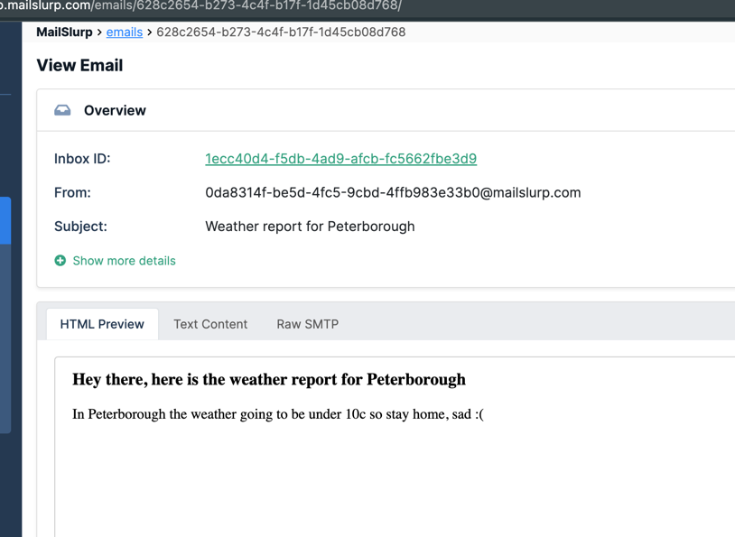
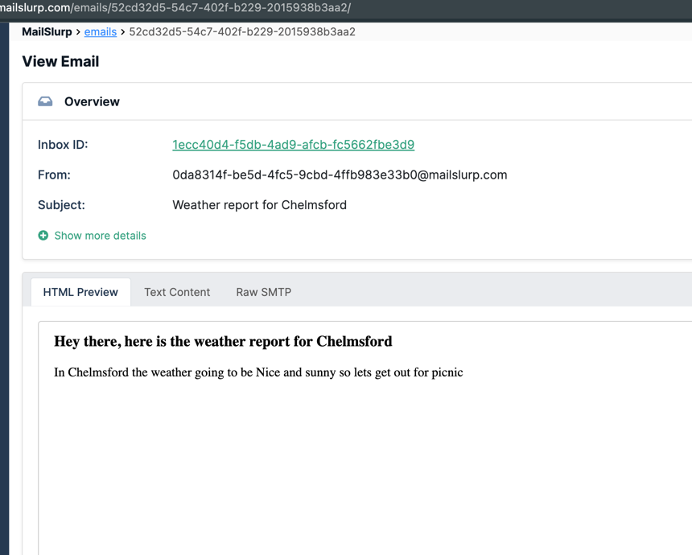

# Technical qa test

This is a technical test for QA Engineer position at [BoomerangMessaging](https://boomerangmessaging.com/).


**Note:** _In order to test the email functionality, you need to have a valid API key from [MailSlurp](https://mailslurp.com/), so for testing purpose i have added API key in the npm scripts, you can use it or you can create your own API key and use it,
Also created 2 inbox id's for testing from & to_

### Prerequisites

Install dependencies
```bash
npm install
```

Run tests from Cypress Test Runner, use below command to run tests with environment variable

```bash
export CYPRESS_MAILSLURP_API_KEY=241d568329dab41766ce4aa66036e362e3b2c0d542bd80b29c354753e85f80bc
npx cypress open
```

Run tests using npm command with chrome headed browser

```bash
npm run cypress:run
```

Run tests by default with chrome headed browser

```bash
npm run cypress:run:headless
```

### Email functionality reports:

Sample bad weather Email report



Sample good weather Email report



To check the email received, i have used below code snippet

```js
  cy.mailslurp()
                            .then(mailslurp => mailslurp.waitForLatestEmail(toEmailDetails.inboxId, 30000))
                            .then(email => {
                                expect(email.body).to.include(cityName);
                                expect(email.subject).to.include(cityName);
                                cy.log("Email received with the city name: " + cityName)
                            });
```

For sending email, i have used below code snippet

```js
  cy.mailslurp()
    .then(mailslurp => mailslurp.sendEmail(toEmailDetails.inboxId, {
        to: [toEmailDetails.address],
        from: fromEmailAddress,
        subject: "Weather report for " + cityName,
        body: "<html><h3>Hey there, here is the weather report for " + cityName + "<h3></h3><p>In " + cityName + " the weather going to be under 10c so stay home, sad :(</p></html>",
        isHTML: false
    }))
```
Reference: [https://docs.mailslurp.com/cypress-mailslurp/#timeouts](https://docs.mailslurp.com/cypress-mailslurp/#timeouts)
